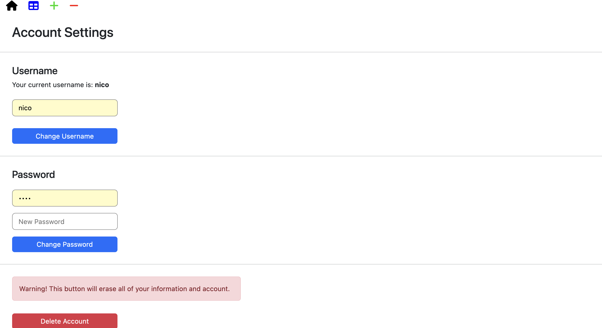
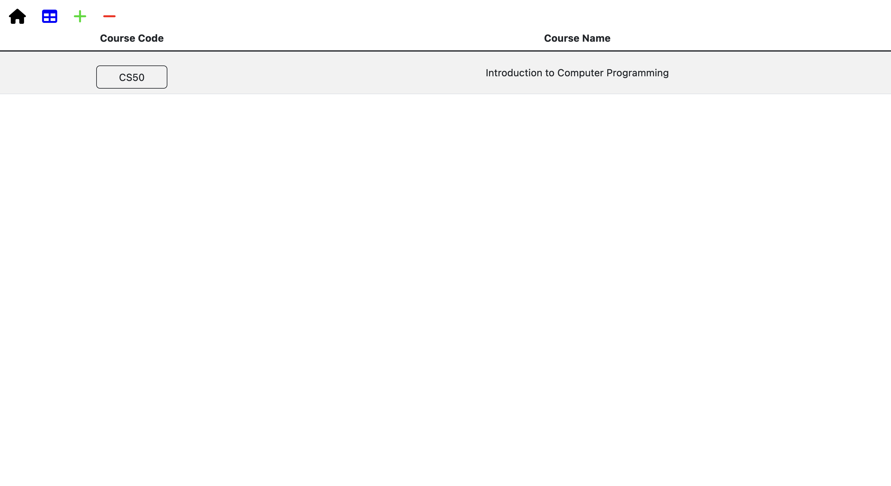
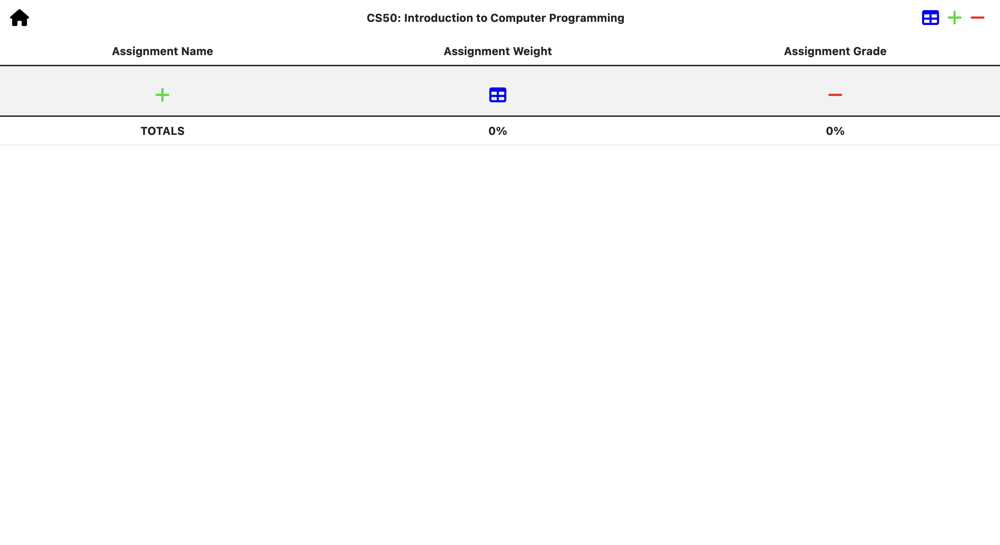

# **Gradify**
An intuitive grading software for students

# Video Demo: 
[Video Demonstration](https://youtu.be/rUGVC7Z3PqY)

# Inspiration & Process:
Since I began writing tests and exams, I always received tests and their respective grades but lost track of them periodically. I would always wonder what my **current grade** in the course was, but had to wait to the last week prior to exams for the teacher to release that information.

If only there was a way to input your grades somewhere one time and forget about them, always having the ability to see your current **course grade**... 

*WAIT! THAT'S **GRADIFY**!*

Gradify is the student-focused solution to keeping track of all received tests, quizzes, assignments, presentations, and anything else you can think of!

The idea for this web application arose from a personal desire (and frankly, need) to know exactly where my **grades** were at throughout the year.

**Gradify** makes this process simple and quick through a lightweight database approach which utilizes SQLite3 alongside Python, Flask, CSS, HTML, and JavaScript.

Gradify is **session** and **account** based, meaning you never need to worry about losing all your inputted assignment and course information (as long as you remember your login credentials, of course).

Its features include, but are not limited to:
- Authorization System (register/login)
- Database storage (SQLite3)
- Bootstrap styling integration
- Flask werkzeug password security integration
- Seperate databases for courses and assignments

# Description:
Gradify is a free, intuitive, and quick platform that allows students to organize all of their assignments and grades into one dual-level spreadsheet which follows a **course --> assignments** format.

After registering for an account on Gradify and logging in, you are greeted with the home page

## Home Page:
In the Home Page, you are greeted by the Gradify logo with **three** interactive icons below.

1. The **+** icon is used to ***add courses*** to your personal grades database.
2. The **table** icon is used to ***view courses*** from your personal database.
3. The **-** icon is used to ***remove courses*** from your personal grades database.

## Account Settings:
The account settings page has two main purposes:

1. Changing your username (done through the first form on the page titled *Username*)
2. Changing your password (done through the second form on the page titled *Password*)

## Adding Courses:
The first step to populating your grades database is adding courses through the **+** icon on the home page, which redirects you do the *adding courses* page.

To do this you need to provide two pieces of information:
1. The **course code**
2. The **course name**

After this, you must press the green **Add Course** button to populate your database with the new course.

## Viewing Courses:
After adding a course through the **adding courses** page, you will be redirected to your personal **courses page**.

Here you will find a table populated with all the courses you have personally added.

In order to view more details about any course and its assignments, you can simply press the button which holds the **course code**. This will redirect you to a page to view your course-specific **assignments**.

## Removing Courses:
If you ever add a course incorrectly, finish a course, or have any need to remove a course, you can head to the **removing courses** page from any other page by clicking on the **-** icon that can be found either at the top icons on most pages, or under the logo on the **main page**.

After pressing the **-** icon, you must select the course you wish to remove from the provided **dropdown** and submit the form through the red **Drop Course** button.

## Adding Assignments:
After adding a course, you can populate the course with **assignments** to keep track of your **course grade**.

To do this, you must go into the specific **course page** through the **course code** button in the general **courses page**. Once at the **assignments table**, you can press the green **+** icon under the table to add an assignment. This will redirect you to the **add assignments** page. Here, you will provide **three** pieces of information for each assignment:
1. The **Assignment Name**
2. The **Assignment Weight**
3. The **Assignment Grade**

After filling out this information, you must press the **Add Assignment** button to submit the form. This will redirect you to the **courses page** where you can click into your specific **course** and view the newly populated table with your assignment in it.

## Viewing Assignments:
From your **courses page**, you can click on any **course code** button to access the **assignments page**.

After being redirected to your **assignments page**, you will find another table populated with course-specific assignments. These assignments are structured in table rows, where each row belongs to **one** assignment.

At the bottom of the page, you will find a footer row that details the total **weight** and **grade** of all your assignments. Each time you add or remove an assignment these totals will automatically refresh and update to provide the most up-to-date **course grade** based on the provided assignments.

## Removing Assignments:
If you ever incorrectly input an assignment, its weight/grade, or if you made any other mistake, you can simply remove it from the specific **course table** by clicking on the **-** icon under the **course table**.

This will redirect you to a form where you will be greeted by a dropdown to select the assignment to **remove** from the course table.

Once selected, submit the form through the red **Remove Assignment** button, this will redirect you to the general **courses page** where you can navigate back into your course to find that your assignment has been successfully **removed**.

